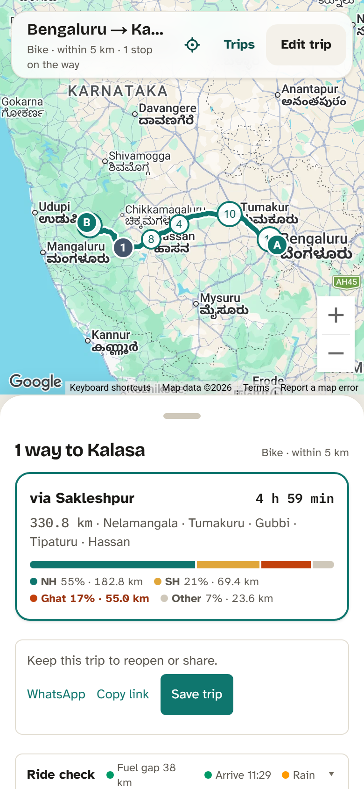
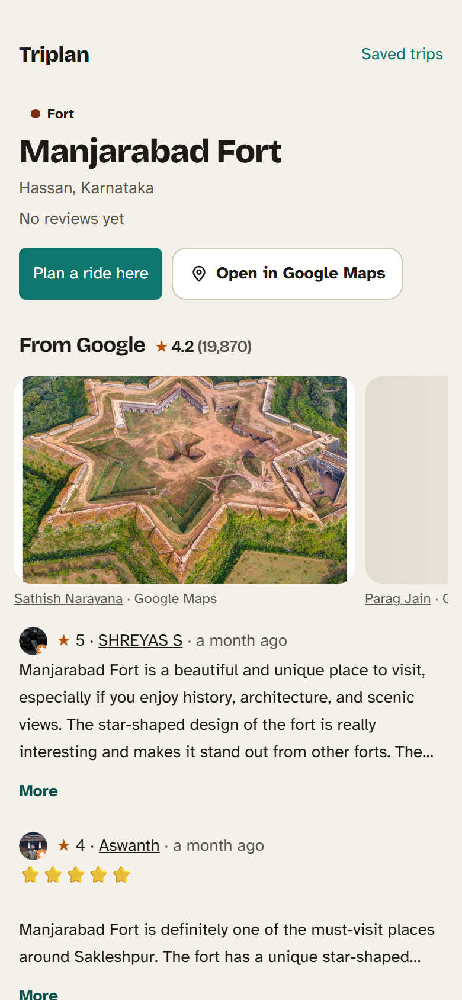
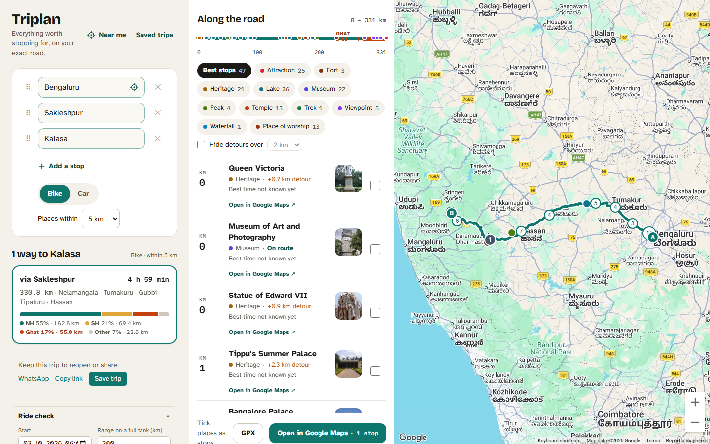
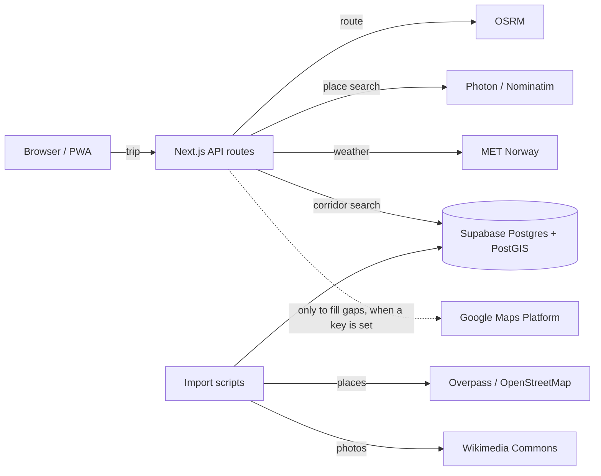

# Triplan

**Everything worth stopping for, on your exact road.**

Triplan is a route explorer for bike and car travellers in India. Pick a start, a destination and any stops on the way, and it lists every temple, fort, viewpoint, waterfall, lake, trek, food stop and fuel station along _that_ road, in kilometre order, with the best season, the best vehicle and what to carry for each.

**Live app:** [triplan-blue.vercel.app](https://triplan-blue.vercel.app)

| Planner (phone)                                     | Place (phone)                                           | Planner (desktop)                                       |
| --------------------------------------------------- | ------------------------------------------------------- | ------------------------------------------------------- |
|  |  |  |

## What it does

- **Places on your road, in km order.** A PostGIS corridor search over 40,000+ places from OpenStreetMap: what is on the road and what is a detour, and how far.
- **Up to three route options**, each with how its distance splits into national highway, state highway, ghat roads and other roads, and where the ghats are.
- **Ride check**: the longest stretch without a fuel station against your tank range, arrival against sunset, and the weather (rain, wind, temperature) at each part of the road at the time you get there.
- **Place guides**: best months on a 12-month strip, best vehicle and last-mile note, what to carry this season, timings and fees, photos from Wikimedia Commons with credits.
- **Near me**: well-known places you can reach within 30 minutes to half a day _by road_, and a ride mode that shows what is coming up ahead.
- **Share and take it with you**: share cards for WhatsApp, saved trips with their own link, "Open in Google Maps" with every stop in order, GPX export for OsmAnd, Organic Maps and Garmin.
- **Works on a phone first**, installs as an app (PWA), and runs on a fully open stack: no API key is needed to run it.

## How it works



1. The planner sends the stops to `POST /api/route`, which asks OSRM for up to three routes, names each by the towns it passes ("via Sakleshpur") and works out its road mix. Ghats are found from the road's shape: stretches that turn more than 300° per km over 2 km.
2. `POST /api/places/along` runs `places_along_route` in PostGIS: the route is simplified once, places within the corridor (2–25 km) are found with a spatial index, and each gets its km from the start (`ST_LineLocatePoint`) and its detour from the road.
3. Every external service sits behind a provider interface (`src/server/providers/`), validated with Zod, cached in the database and throttled to each service's fair-use policy, so tests never touch the network.

More in [docs/](docs/): product spec, architecture, data model, build plan and design.

## Tech stack

Next.js 15 (App Router) · TypeScript (strict) · Tailwind CSS 4 · Supabase Postgres + PostGIS · Drizzle ORM · MapLibre GL JS with OpenFreeMap tiles (Google Maps when a key is set) · OSRM · Photon and Nominatim · MET Norway · Serwist (PWA) · Zod · Vitest · Playwright · Vercel.

## Run it yourself

### 1. What you need

- **Node.js 22 or newer** and **pnpm 10** (`corepack enable` installs the pnpm version pinned in `package.json`).
- **Git**.
- A free **[Supabase](https://supabase.com)** account (the database).
- For deploying: a free **[Vercel](https://vercel.com)** account.

### 2. Clone and install

```bash
git clone https://github.com/Subhi2/Triplan.git
cd Triplan
corepack enable
pnpm install
```

### 3. Create the database

1. In Supabase, **New project**. Pick the region nearest your users (the live app uses Mumbai, `ap-south-1`) and save the database password.
2. Open **Connect** (top of the project page) and copy two connection strings, putting your password in each:
   - **Session pooler** (port 5432): for your computer.
   - **Transaction pooler** (port 6543): for Vercel.

PostGIS and `pg_trgm` are switched on by the first migration; there is nothing to enable by hand.

### 4. Configure

```bash
cp .env.example .env.local
```

Then fill in `.env.local`:

| Variable                          | Needed  | What to put                                                                                                                                   |
| --------------------------------- | ------- | --------------------------------------------------------------------------------------------------------------------------------------------- |
| `DATABASE_URL`                    | **yes** | The session pooler string from step 3 (on Vercel: the transaction pooler string).                                                             |
| `NOMINATIM_USER_AGENT`            | **yes** | Who you are, e.g. `my-triplan/0.1 (you@example.com)`. Nominatim's policy requires it; it is also sent to Photon and Overpass.                 |
| `OSRM_BASE_URL`                   | no      | Routing server. Default: the public OSRM demo server (fair use only; self-host for real traffic).                                             |
| `NOMINATIM_BASE_URL`              | no      | Default `https://nominatim.openstreetmap.org` (1 request per second, used only when Enter is pressed).                                        |
| `PHOTON_BASE_URL`                 | no      | Default `https://photon.komoot.io/api` (suggestions while typing).                                                                            |
| `OVERPASS_URLS`                   | no      | Overpass servers for the OpenStreetMap import, tried in order.                                                                                |
| `NEXT_PUBLIC_MAP_STYLE_URL`       | no      | A MapLibre style URL. Default: OpenFreeMap "liberty".                                                                                         |
| `NEXT_PUBLIC_SITE_URL`            | no      | Your public address, for share cards and the sitemap. Vercel's production address is used if empty.                                           |
| `WRITE_LIMIT_SALT`                | no      | Any random string; salts the hashed visitor IPs used to limit trip saves.                                                                     |
| `NEXT_PUBLIC_GOOGLE_MAPS_API_KEY` | no      | Turns on the Google map and Google photos and reviews for places with none of their own. See [Google Maps (optional)](#google-maps-optional). |
| `NEXT_PUBLIC_GOOGLE_MAP_ID`       | no      | A Google Map ID for Advanced Markers.                                                                                                         |
| `GOOGLE_MAPS_API_KEY`             | no      | A separate server-only Google key; empty uses the key above.                                                                                  |

The `SUPABASE_*` keys and the YouTube, Instagram and Anthropic variables in `.env.example` are for later phases; the app does not read them yet. Never commit `.env.local`.

### 5. Create the tables and load places

```bash
pnpm db:migrate                               # tables, PostGIS functions, indexes
pnpm db:seed                                  # categories, carry items and the hand-written demo places
pnpm db:import-osm -- --region=karnataka      # places from OpenStreetMap for one state
pnpm db:import-photos                         # photos from Wikimedia Commons, with credits
```

`--region` takes any key in `src/server/services/osmRegions.ts`, several separated by commas, or `all` for every state and union territory. The import makes one request at a time to the public Overpass servers, so a big state takes several minutes and all of India takes hours; re-running is safe (places are upserted on their OpenStreetMap id), and `--skip=` resumes a run.

### 6. Run

```bash
pnpm dev            # http://localhost:3000
```

Try `http://localhost:3000/?from=Bengaluru@77.5946,12.9716&via=Sakleshpur@75.785,12.943&to=Kalasa@75.356,13.234`, or type any trip in an imported state.

### 7. Test

```bash
pnpm lint && pnpm typecheck && pnpm test     # ESLint, TypeScript, Vitest unit tests (no network, no database)
pnpm test:integration                         # SQL functions against the database in DATABASE_URL
pnpm exec playwright install chromium         # once
pnpm test:e2e                                 # Playwright, desktop and 375 px phone, on its own dev server
```

The integration tests and the end-to-end tests use the database in `DATABASE_URL` and expect the seed data (`pnpm db:seed`). Every external service is mocked with recorded fixtures (`tests/fixtures/`).

## Deploy to Vercel

1. Push your clone to GitHub, then in Vercel **Add New → Project** and import it. The framework (Next.js), install command (`pnpm install`) and build command are detected.
2. Under **Environment Variables**, add at least `DATABASE_URL` (the **transaction pooler** string, port 6543) and `NOMINATIM_USER_AGENT`, plus any optional ones from the table above.
3. **Deploy.** `vercel.json` already pins the functions to Mumbai (`bom1`, next to the database) and adds a daily cron on `/api/health`, which keeps the free Supabase project from pausing and clears old rate-limit counters. Change the region there if your database is elsewhere.
4. Check `https://<your-app>/api/health` returns `{"ok":true,...}` with your place count, then paste a trip link into WhatsApp to see its share card.

Every push to `main` deploys to production; other branches get preview addresses. Vercel's free Hobby plan is for non-commercial use.

## Google Maps (optional)

Without a key the app uses MapLibre with OpenStreetMap tiles and shows no Google content. With a key it shows the Google map, and Google photos and reviews only for places that have none of their own, within a daily budget (`src/server/providers/google/budget.ts`) that keeps usage inside Google's free monthly caps.

1. In the Google Cloud console, create a project with billing, and enable the **Maps JavaScript API** and **Places API (New)**.
2. Create one API key limited to those two APIs, and optionally a Map ID.
3. Set per-day quotas (Maps JavaScript loads 2,250; Place Details and Place Photo 225 each) and a budget alert.
4. Put the key in `NEXT_PUBLIC_GOOGLE_MAPS_API_KEY` (and the Map ID in `NEXT_PUBLIC_GOOGLE_MAP_ID`), locally and on Vercel.

Google's terms shape the code: only Google place ids are stored; ratings, reviews and photos are fetched, shown with credit and thrown away; and Google content never appears on the MapLibre map.

## Project layout

```
src/app/              pages and API routes (App Router)
src/components/       React components: map, trip planner, place details, Near me
src/lib/              shared, pure code: geometry, formats, trip URLs, ride check, GPX
src/server/           server only: database (Drizzle schema, SQL migrations), providers, services
scripts/              seed, imports, fixtures, screenshots
tests/                unit (Vitest), integration (database), e2e (Playwright), fixtures
docs/                 product spec, architecture, data model, build plan, design
```

## Data and licences

| Data                         | Source                                                                          | Licence                                                       |
| ---------------------------- | ------------------------------------------------------------------------------- | ------------------------------------------------------------- |
| Places, towns, fuel stations | © [OpenStreetMap](https://www.openstreetmap.org/copyright) contributors         | ODbL 1.0                                                      |
| Map tiles                    | [OpenFreeMap](https://openfreemap.org), OpenMapTiles, OpenStreetMap             | per provider, credited on the map                             |
| Photos                       | [Wikimedia Commons](https://commons.wikimedia.org)                              | each photo's own licence and author, stored and shown with it |
| Routing                      | [OSRM](https://project-osrm.org) on OpenStreetMap data                          | BSD-2 (software), ODbL (data)                                 |
| Place search                 | [Photon](https://photon.komoot.io) (komoot), [Nominatim](https://nominatim.org) | ODbL data, usage policies respected                           |
| Weather                      | [MET Norway](https://api.met.no) Locationforecast                               | CC BY 4.0                                                     |
| Google content (optional)    | Google Maps Platform                                                            | Google's terms; never stored                                  |

The code is under the [MIT licence](LICENSE).

## Screenshots

The images above are made with `pnpm screenshots` (Playwright, phone 390×844 and desktop 1440×900, into `docs/media/`):

```bash
pnpm screenshots                                          # against pnpm dev on :3000
pnpm screenshots -- --base=https://triplan-blue.vercel.app
```

---

Built by [Subhash](https://github.com/Subhi2) as a free-time project.
