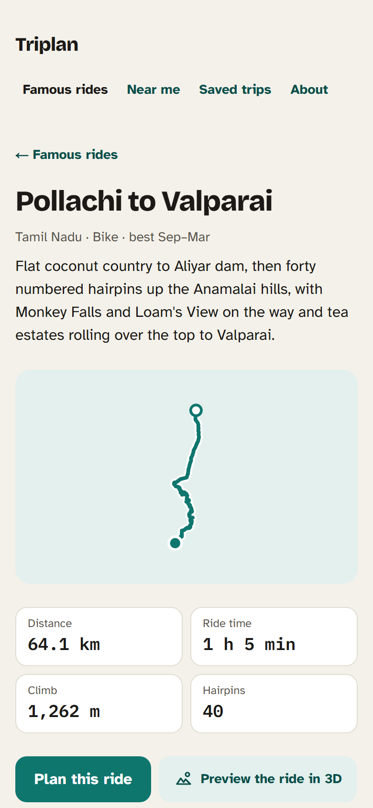
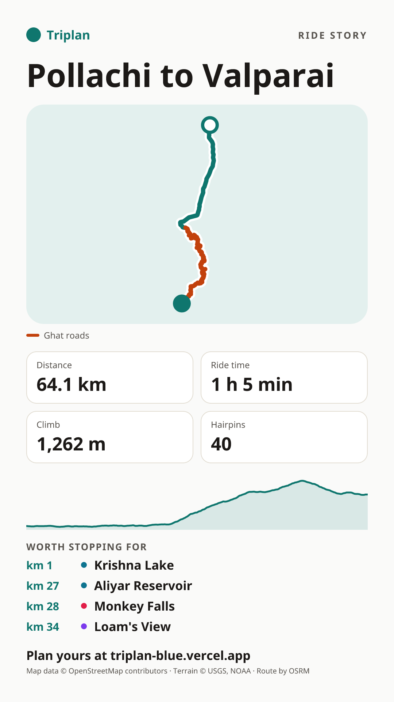
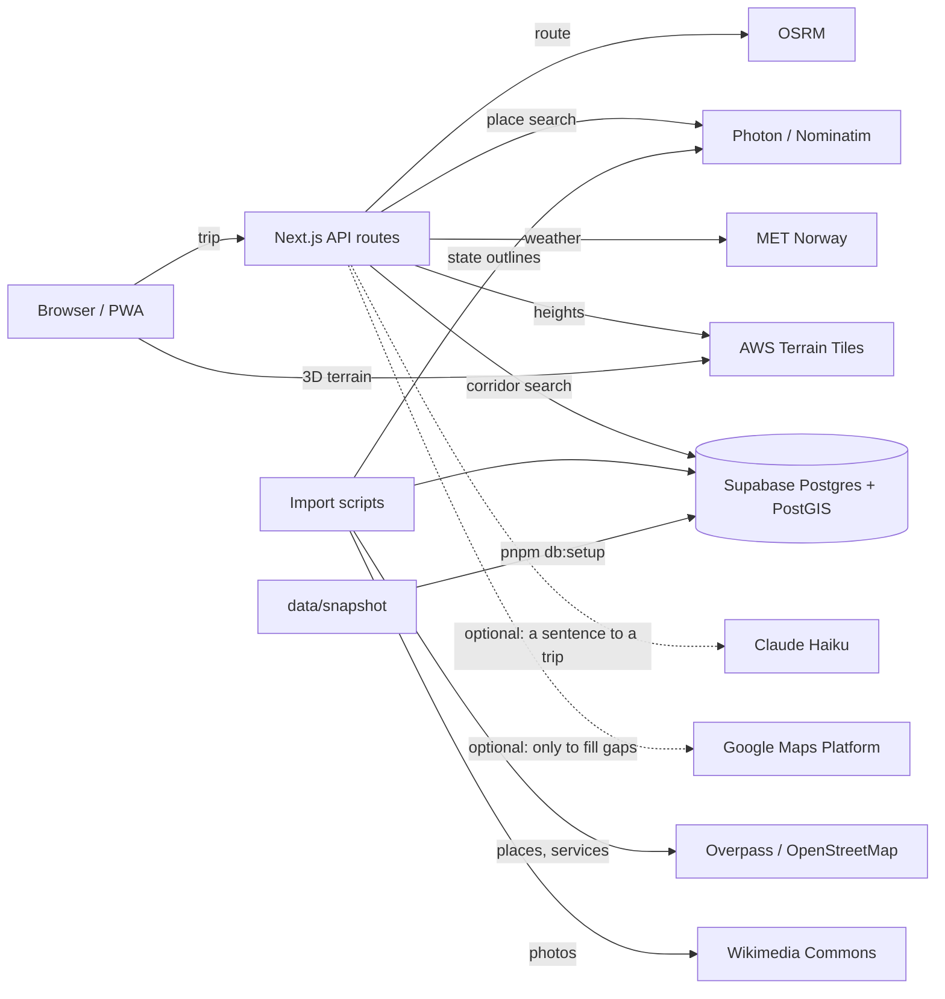

# Triplan

**See every hairpin, climb and stop on your road before you ride it.**

Triplan is a route planner for bike and car travellers in India. Pick a start, a destination and any stops on the way, and it shows everything worth stopping for on _that_ road: temples, forts and palaces, viewpoints, peaks, waterfalls, lakes and dams, beaches, caves, museums, national parks and fuel, in kilometre order. Each route also gets its hairpins, its climbs and a 3D flyover, the hospitals and puncture shops along the way, and a split into days with towns to sleep in.

**Live app:** [triplan-blue.vercel.app](https://triplan-blue.vercel.app)

| Planner (phone)                                     | Famous ride (phone)                                    | Ride story poster                                                                     | Planner (desktop)                                       |
| --------------------------------------------------- | ------------------------------------------------------ | ------------------------------------------------------------------------------------- | ------------------------------------------------------- |
|  |  |  |  |

## What it does

**Know the road**

- **Places on your road, in km order.** A PostGIS corridor search over 90,000+ places from OpenStreetMap, in every Indian state and union territory, shows what is on the road, what is a detour, and how far off it is. That includes every named temple, well-known villages such as Masinagudi, dams, botanical gardens, palaces and museums.
- **National parks by their outline.** 570 national parks, wildlife sanctuaries and tiger reserves are stored with their boundaries, so a road through Bandipur or Mudumalai lists the park at the km where the road enters it, 0 m off the road, instead of missing it because the park's centre is far away.
- **Up to three route options.** Each one shows how its distance splits into national highway, state highway, ghat and other roads, and where the ghats are.
- **Hairpins and twistiness** on every route card, worked out from the road's shape (the method roadcurvature.com uses): "24 hairpins · 18 km twisty".
- **Ups and downs.** An elevation profile from open terrain data, with the total climb, the highest point and each big climb named after the town at its foot. Scrub along it and a marker moves on the map.
- **3D ride preview.** A flyover of the whole route over 3D terrain that slows down in the ghats and pops up each place as you pass it. It can be saved as a 30-second vertical video.

**Plan the ride**

- **Ride check.** The longest stretch without fuel against your tank range, the longest stretch without a hospital, your arrival against sunset, and the weather at each part of the road for the time you get there.
- **Safety on the way.** Hospitals, police stations, ATMs, puncture shops and repair shops near the road (110,000+ from OpenStreetMap), each with a count per 50 km, pins on the map and tap to call.
- **Multi-day split.** Set your riding hours a day and the route is split into days, each ending in a town on the road with stays nearby, plus one GPX track per day.
- **Plan in plain words** (optional, Claude Haiku): type "2-day monsoon ride from Pune with waterfalls, under 250 km" and the planner fills itself in.
- **Place guides.** Best months on a 12-month strip, the best vehicle and a last-mile note, what to carry this season, timings and fees, and Wikimedia Commons photos with credits.

**Share it**

- **Famous rides.** A gallery of 20+ well-known Indian rides (Valparai's 40 hairpins, Manali–Leh, the Konkan coast), each with its stats and profile, ready to open in the planner.
- **Ride story.** A 1080×1920 poster of your route (shape, km, climb, hairpins, top stops) for Instagram stories or WhatsApp status.
- **Take it with you.** Saved trips with their own link, "Open in Google Maps" with every stop in order, GPX for OsmAnd, Organic Maps and Garmin, and share cards on every link.
- **Near me.** Well-known places within reach _by road_, and a ride mode that shows what is coming up ahead.
- **Search that knows small places.** Our own places come first as you type: "kalasa" lists the town and the temple there, and a village like Masinagudi is found by its name. Photon fills in the rest.
- **Phone first.** It installs as an app (PWA) and runs on a fully open stack: no API key is needed to run it.

## How it works



1. The planner sends the stops to `POST /api/route`, which asks OSRM for up to three routes. Each route is named after a town it passes ("via Sakleshpur") and gets its road mix and hairpin count. Ghats and hairpins are found from the road's shape.
2. `POST /api/places/along` runs `places_along_route` in PostGIS. The route is simplified once, places within the corridor (2–25 km) are found with a spatial index, and each gets its km from the start (`ST_LineLocatePoint`) and its detour from the road. Places with an outline (national parks, sanctuaries) are matched by their area: km where the road enters it, detour 0 when the road crosses it. Safety stops and overnight stays use the same search over a separate `service_point` table.
3. The elevation profile reads heights every 100 m from Terrarium tiles (SRTM for India), smooths them and finds the climbs. The 3D preview drapes the same tiles under MapLibre and flies a chase camera along the route.
4. Every external service sits behind a provider interface (`src/server/providers/`). Responses are validated with Zod, cached in the database and throttled to each service's fair-use policy, so tests never touch the network.

More in [docs/](docs/): product spec, architecture, data model, build plan and design.

## Tech stack

Next.js 15 (App Router) · TypeScript (strict) · Tailwind CSS 4 · Supabase Postgres + PostGIS · Drizzle ORM · MapLibre GL JS with OpenFreeMap tiles (Google Maps when a key is set) · OSRM · Photon and Nominatim · AWS Terrain Tiles · MET Norway · Mediabunny (video) · Claude Haiku (optional) · Serwist (PWA) · Zod · Vitest · Playwright · Vercel.

## Run it yourself

From `git clone` to your own deployed copy. The required parts take about 15 minutes.

### 1. What you need

- **Node.js 22 or newer** and **pnpm 10**. `corepack enable` installs the pnpm version pinned in `package.json`.
- **Git**.
- A free **[Supabase](https://supabase.com)** account for the database.
- For deploying: a free **[Vercel](https://vercel.com)** account.
- Optional: an [Anthropic](https://console.anthropic.com) key for "plan in plain words", and a Google Maps key. The app runs fully without both.

### 2. Clone and install

```bash
git clone https://github.com/Subhi2/Triplan.git
cd Triplan
corepack enable
pnpm install
```

### 3. Create the database

1. In Supabase, click **New project**. Pick the region nearest your users (the live app uses Mumbai, `ap-south-1`), and save the database password.
2. Open **Connect** at the top of the project page and copy two connection strings, putting your password in each:
   - **Session pooler** (port 5432): for your computer, the setup command and the import scripts.
   - **Transaction pooler** (port 6543): for Vercel.

The first migration switches on PostGIS and `pg_trgm`, so there is nothing to enable by hand.

### 4. Configure

```bash
cp .env.example .env.local
```

Then fill in `.env.local`. Only the first two are required:

| Variable                          | Needed  | What to put                                                                                                                          |
| --------------------------------- | ------- | ------------------------------------------------------------------------------------------------------------------------------------ |
| `DATABASE_URL`                    | **yes** | The session pooler string from step 3. On Vercel, use the transaction pooler string.                                                 |
| `NOMINATIM_USER_AGENT`            | **yes** | Who you are, e.g. `my-triplan/0.1 (you@example.com)`. Nominatim's policy requires it; it is also sent to Photon and Overpass.        |
| `OSRM_BASE_URL`                   | no      | The routing server. Default: the public OSRM demo server (fair use only; self-host for real traffic).                                |
| `NOMINATIM_BASE_URL`              | no      | Default `https://nominatim.openstreetmap.org` (1 request per second, used only when Enter is pressed).                               |
| `PHOTON_BASE_URL`                 | no      | Default `https://photon.komoot.io/api` (suggestions while typing).                                                                   |
| `OVERPASS_URLS`                   | no      | Overpass servers for the imports, tried in order. Default: overpass-api.de, z.overpass-api.de, maps.mail.ru, kumi.systems.           |
| `NEXT_PUBLIC_MAP_STYLE_URL`       | no      | A MapLibre style URL. Default: OpenFreeMap "liberty".                                                                                |
| `NEXT_PUBLIC_TERRAIN_TILES_URL`   | no      | Terrarium PNG tiles `…/{z}/{x}/{y}.png` for the elevation profile and 3D terrain. Default: AWS Terrain Tiles (free, no key).         |
| `NEXT_PUBLIC_SITE_URL`            | no      | Your public address, for share cards and the sitemap. Vercel's production address is used if empty.                                  |
| `WRITE_LIMIT_SALT`                | no      | Any random string. It salts the hashed visitor IPs used for rate limits. Default: derived from `DATABASE_URL`.                       |
| `CRON_SECRET`                     | no      | Any random string. Vercel Cron sends it to `/api/health`; without it the daily clean-up of old counters and cache rows is skipped.   |
| `ANTHROPIC_API_KEY`               | no      | Turns on "plan in plain words". Empty hides the box and makes no AI calls. See [Plan in plain words](#plan-in-plain-words-optional). |
| `ANTHROPIC_TRIP_MODEL`            | no      | The Claude model for it. Default `claude-haiku-4-5`.                                                                                 |
| `NEXT_PUBLIC_GOOGLE_MAPS_API_KEY` | no      | Turns on the Google map, and Google photos and reviews for places with none of their own. See [Google Maps](#google-maps-optional).  |
| `NEXT_PUBLIC_GOOGLE_MAP_ID`       | no      | A Google Map ID for Advanced Markers.                                                                                                |
| `GOOGLE_MAPS_API_KEY`             | no      | A separate server-only Google key. Empty uses the key above.                                                                         |

The `SUPABASE_*` keys and the YouTube and Instagram variables in `.env.example` are for later phases; the app does not read them yet. Never commit `.env.local`.

### 5. Create the tables and load all the data

```bash
pnpm db:setup
```

This one command:

1. Runs the migrations: tables, PostGIS functions, indexes and row-level security.
2. Loads the data snapshot in `data/snapshot/`: every place (90,000+, all 36 states and union territories), place guide, photo credit, famous ride and service point (110,000+), about 17 MB.

It takes under a minute. Before writing anything it checks every file against its checksum, and it only loads into empty tables. On a database that already has places, `pnpm db:setup -- --replace --yes` empties the snapshot tables first; it refuses while there are saved trips or reviews.

To build the data yourself from the original sources instead (hours of polite, one-at-a-time API calls), run:

```bash
pnpm db:setup -- --from-sources --regions=karnataka,kerala   # or --regions=all
```

This runs these steps in order, and each one can also be run on its own:

```bash
pnpm db:migrate                                # tables only
pnpm db:seed                                   # categories, carry items, the hand-written demo places
pnpm db:import-osm -- --region=karnataka       # places from OpenStreetMap (region keys: src/server/services/osmRegions.ts)
pnpm db:import-photos                          # photos from Wikimedia Commons, with credits
pnpm db:import-descriptions                    # descriptions from Wikipedia and Wikidata, credited
pnpm db:seed-rides                             # route the famous rides in data/rides.json
pnpm db:import-services -- --region=karnataka  # hospitals, police, ATMs, tyre and repair shops, stays
```

Imports are safe to re-run (rows are upserted on their OpenStreetMap id). The places import has options for long runs:

- `--resume` goes on where a stopped run stopped (no network, a sleeping laptop, Overpass down). Each region's saved tiles are kept in `.import-progress/` (not committed), and finished regions are skipped.
- `--part=1/3`, with `--part=2/3` and `--part=3/3` in two more terminals, shares one big state between three runs. Whichever part finishes last closes the places no longer in OpenStreetMap.
- `--tile-deg=0.5` asks for dense states in half-degree tiles, which the public servers answer without timing out.
- `--skip=` leaves regions out.

Before each state, the import asks Nominatim once for the state's outline and never asks Overpass for tiles outside it (about a third of them). An empty Overpass answer counts only when a second server agrees, because a busy server sometimes answers a tile full of places with nothing.

### 6. Run

```bash
pnpm dev            # http://localhost:3000
```

Try [the Bengaluru → Kalasa example](http://localhost:3000/?from=Bengaluru@77.5946,12.9716&via=Sakleshpur@75.785,12.943&to=Kalasa@75.356,13.234), open a famous ride from `/rides`, or type any trip in India.

### 7. Test

```bash
pnpm lint && pnpm typecheck && pnpm test     # ESLint, TypeScript, Vitest unit tests (no network, no database)
pnpm test:integration                         # SQL functions against the database in DATABASE_URL
pnpm exec playwright install chromium         # once
pnpm test:e2e                                 # Playwright, desktop and 375 px phone, on its own dev server (port 3100)
```

The unit and end-to-end tests mock every external service with recorded fixtures (`tests/fixtures/`). The integration tests run against the database in `DATABASE_URL` and expect the loaded data. They write only rows keyed `test:…` and throwaway `test_*` schemas, and remove them afterwards.

## Deploy to Vercel

1. Push your clone to GitHub. In Vercel, click **Add New → Project** and import it. The framework (Next.js), install command (`pnpm install`) and build command are detected.
2. Under **Environment Variables**, add `DATABASE_URL` (the **transaction pooler** string, port 6543) and `NOMINATIM_USER_AGENT`, plus any optional ones from the table above (`ANTHROPIC_API_KEY`, the Google keys, `NEXT_PUBLIC_SITE_URL`, `WRITE_LIMIT_SALT`, `CRON_SECRET`).
3. Click **Deploy**. `vercel.json` already pins the functions to Mumbai (`bom1`, next to the database) and adds a daily cron on `/api/health`, which keeps the free Supabase project from pausing and clears old counters. Change the region there if your database is elsewhere.
4. In the project's **Analytics** tab, switch on **Web Analytics** for page views (no cookies; the `<Analytics />` component is already in the layout).
5. Optional: add your own domain under **Settings → Domains**, and set `NEXT_PUBLIC_SITE_URL` to it.

Every push to `main` deploys to production, and other branches get preview addresses. Vercel's free Hobby plan is for non-commercial use.

### After deploying, check

- `https://<your-app>/api/health` returns `{"ok":true,...}` with your place count.
- `/rides` lists the famous rides, and "Plan this ride" opens one in the planner.
- On a route, the profile appears under the route cards and "Preview the ride in 3D" flies it.
- Paste a trip link into WhatsApp to see its share card.
- `pnpm screenshots -- --base=https://<your-app>` takes fresh screenshots for your README.

## Plan in plain words (optional)

1. In the [Anthropic Console](https://console.anthropic.com), create an API key, then set a **monthly spend limit** under Billing (for example US$5).
2. Put the key in `ANTHROPIC_API_KEY`, locally and on Vercel, and redeploy.

The box appears on the empty planner. Each request costs about US$0.002 with Claude Haiku. The server allows 6 requests per visitor an hour and 200 a day in all. The rider's text is sent to Anthropic to be read, and it is never stored or logged.

## Google Maps (optional)

Without a key, the app uses MapLibre with OpenStreetMap tiles and shows no Google content. With a key, it shows the Google map, plus Google photos and reviews only for places that have none of their own. A daily budget (`src/server/providers/google/budget.ts`) keeps usage inside Google's free monthly caps.

1. In the Google Cloud console, create a project with billing, and enable the **Maps JavaScript API** and **Places API (New)**.
2. Create one API key limited to those two APIs, and optionally a Map ID.
3. Set per-day quotas (Maps JavaScript loads 2,250; Place Details and Place Photo 225 each) and a budget alert.
4. Put the key in `NEXT_PUBLIC_GOOGLE_MAPS_API_KEY` (and the Map ID in `NEXT_PUBLIC_GOOGLE_MAP_ID`), locally and on Vercel.

Google's terms shape the code:

- Only Google place ids are stored. Ratings, reviews and photos are fetched, shown with credit, and thrown away.
- Google content never appears on the MapLibre map, the 3D preview or the ride story.
- The data snapshot leaves Google ids out.

## Your own servers (optional)

- **Routing**: the public OSRM server is for light use. For real traffic, run [OSRM](https://github.com/Project-OSRM/osrm-backend) with an India extract from Geofabrik and point `OSRM_BASE_URL` at it.
- **Terrain**: any Terrarium-encoded tile set works in `NEXT_PUBLIC_TERRAIN_TILES_URL`. The server needs CORS for GET, because the 3D preview loads tiles in the browser.
- **Map style**: any MapLibre style JSON works in `NEXT_PUBLIC_MAP_STYLE_URL`.

## Refreshing the data snapshot (maintainers)

After an import, write the snapshot from the live database and commit it. A full refresh of India:

```bash
pnpm db:import-osm -- --region=all --resume     # places: hours, on a computer that will not sleep
pnpm db:import-services -- --region=all         # hospitals, police, ATMs, repair shops, stays
pnpm db:import-photos                           # Wikimedia photos for new places with a Wikidata link
pnpm db:import-descriptions                     # Wikipedia and Wikidata text for places with none
pnpm db:export-snapshot                         # rewrites data/snapshot (read only on the database)
git add data/snapshot && git commit -m "Refresh the data snapshot"
```

The public Overpass servers allow a few queries at a time per address, so the places import is the slow part. The last pass of the October 2026 refresh of all of India took about four hours with up to 22 runs side by side: one run per small state, `--part` for the big ones, and different server orders in `OVERPASS_URLS` so the runs spread over overpass-api.de, z.overpass-api.de and maps.mail.ru.

The export leaves out trips, reviews, accounts, usage counts, caches, users' photos and Google ids.

## Troubleshooting

| Problem                                                      | Fix                                                                                                                                          |
| ------------------------------------------------------------ | -------------------------------------------------------------------------------------------------------------------------------------------- |
| `DATABASE_URL is not set`                                    | Copy `.env.example` to `.env.local` and fill it in. Scripts read `.env.local`.                                                               |
| `type "geography" does not exist` or no PostGIS              | The database must be Supabase (migrations put PostGIS in its `extensions` schema), or create an `extensions` schema first on plain Postgres. |
| `pnpm db:setup` says tables already have rows                | Use a new database, or `pnpm db:setup -- --replace --yes` on one with no trips or reviews.                                                   |
| `remaining connection slots are reserved` / too many clients | The session pooler allows 15 connections per project. Stop other dev servers or scripts, or use the transaction pooler for the app.          |
| Overpass `429` or `504` during an import                     | The public servers are busy. The import waits and tries the next server in `OVERPASS_URLS`; re-run the command it prints (with `--resume`).  |
| An import stopped (network lost, laptop asleep)              | Run the same command with `--resume`. On a laptop, keep it plugged in with the screen on: many laptops cut the network in standby.           |
| An import is slow                                            | Split big states with `--part=1/3`… and list several servers in `OVERPASS_URLS`, ordered differently per run.                                |
| Routes fail with `Too Many Requests`                         | The public OSRM server is rate limited. Wait a minute (answers are cached for 7 days), or self-host OSRM.                                    |
| No elevation profile or flat 3D terrain                      | The terrain tile server could not be reached. Check `NEXT_PUBLIC_TERRAIN_TILES_URL` and that it allows CORS.                                 |
| No "plan in plain words" box                                 | `ANTHROPIC_API_KEY` is empty. Set it and restart (or redeploy).                                                                              |
| Playwright tests fail to start                               | Run `pnpm exec playwright install chromium` once. The tests start their own server on port 3100.                                             |

## Project layout

```
src/app/              pages and API routes (App Router)
src/components/       React components: map, planner, route profile, 3D preview, place details
src/lib/              shared, pure code: geometry, curvature, elevation, flyover, days, trip URLs, GPX
src/server/           server only: database (Drizzle schema, SQL migrations), providers, services
scripts/              setup, snapshot export, seeds, imports, fixtures, screenshots
data/                 famous rides (rides.json) and the data snapshot (snapshot/)
tests/                unit (Vitest), integration (database), e2e (Playwright), fixtures
docs/                 product spec, architecture, data model, build plan, design
```

## Data and licences

| Data                          | Source                                                                                     | Licence                                                       |
| ----------------------------- | ------------------------------------------------------------------------------------------ | ------------------------------------------------------------- |
| Places, towns, service points | © [OpenStreetMap](https://www.openstreetmap.org/copyright) contributors                    | ODbL 1.0                                                      |
| The data snapshot             | Derived from the above ([data/snapshot/LICENCE.md](data/snapshot/LICENCE.md))              | ODbL 1.0                                                      |
| Map tiles                     | [OpenFreeMap](https://openfreemap.org), OpenMapTiles, OpenStreetMap                        | per provider, credited on the map                             |
| Terrain heights               | [AWS Terrain Tiles](https://registry.opendata.aws/terrain-tiles/) (SRTM, GMTED and others) | open data, credited on the profile and in the 3D view         |
| Photos                        | [Wikimedia Commons](https://commons.wikimedia.org)                                         | each photo's own licence and author, stored and shown with it |
| Routing                       | [OSRM](https://project-osrm.org) on OpenStreetMap data                                     | BSD-2 (software), ODbL (data)                                 |
| Place search, state outlines  | [Photon](https://photon.komoot.io) (komoot), [Nominatim](https://nominatim.org)            | ODbL data, usage policies respected                           |
| Weather                       | [MET Norway](https://api.met.no) Locationforecast                                          | CC BY 4.0                                                     |
| Video encoding                | [Mediabunny](https://mediabunny.dev)                                                       | MPL-2.0                                                       |
| Google content (optional)     | Google Maps Platform                                                                       | Google's terms; never stored                                  |

The code is under the [MIT licence](LICENSE).

## Screenshots

The images above are made with `pnpm screenshots`, which uses Playwright at phone 390×844 and desktop 1440×900 and writes to `docs/media/`:

```bash
pnpm screenshots                                          # against pnpm dev on :3000
pnpm screenshots -- --base=https://triplan-blue.vercel.app
```

---

Built by [Subhash](https://github.com/Subhi2) as a free-time project.
